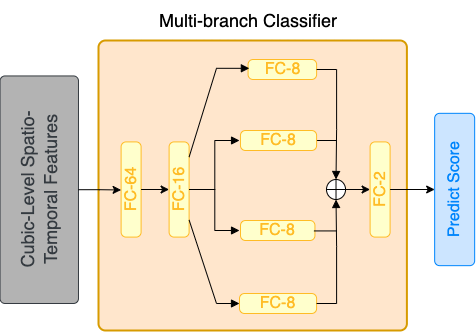

# Multi-branch Classifier (MC)

Inspired by Inception Module and multi-models, MC takes multi-branch structure to provide different views and enrich 
representation as well. 
In detail, MC consists of four FC layers. 

```warning
In our study, MC only does linear projection at each branch instead of convolutional operation or the neural network, 
although it can be Conv $$1\times 1$$.
```

<p align="center" width="100%">
    
</p>

The dimension change is `64` $$\rightarrow$$ `16` $$\rightarrow$$ `[8,8,8,8]` $$\rightarrow$$ concatenate to `32` 
$$\rightarrow$$ `num\_class`, where `num\_class` represents the number of class. 
In our experiment, it is `2`. 
When we convert the dimension from `16` to `32`, the above figure shows that we apply multi-branch structure to convert 
the dimension to `8` and repeat `4` times. 
Then, we concantenate them as a `32`-dimensional tensor. 

```tip
The multi-branch structure broadens the network. 
MC can provide more features and view the object from different angles.
```
